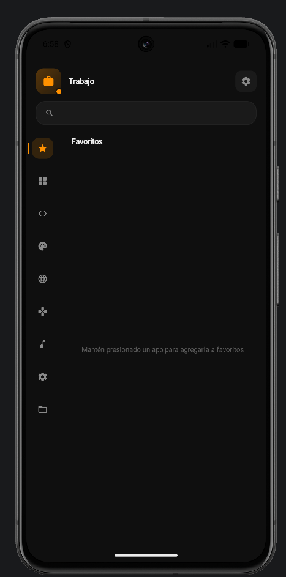

# TAPO-Launcher


Launcher para Android hecho con **Kotlin + Jetpack Compose**. Busca ser ligero, minimalista y práctico para uso diario, con soporte para categorías, perfiles de trabajo, icon packs y ajustes visuales.

<p align="center">
  
  
  
</p>

## Características

- **Categorías configurables** — Favoritos, Desarrollo, Gráficos, Internet, Juegos, Multimedia, Sistema y Utilidades.
- **Categorías inteligentes** — Smart grouping automático para Wallets (Binance, Yape, PayPal), Compras (Rappi, Amazon), Finanzas (merge inteligente), y Dev (Termux, GitHub).
- **Perfiles Personal / Trabajo** — Detecta un Work Profile real y permite lanzar apps del perfil laboral.
- **Apps ocultas** — Oculta apps permanentemente o temporalmente (5 min, hasta reinicio, indefinido) con persistencia en DataStore. Gestión completa desde el panel de ajustes.
- **Menú contextual** — Long-press en cualquier app abre un menú flotante posicionado cerca del ícono con acciones: Favorito, Mover, Información, Desinstalar.
- **Búsqueda instantánea** — Filtra apps por nombre o paquete.
- **Ajustes de interfaz** — Tema claro/oscuro, tamaño de íconos, columnas, fondo de íconos y etiquetas.
- **Icon packs** — Detecta packs instalados y resuelve íconos desde su `appfilter.xml`.
- **Personalización de categorías** — Cambia nombre, ícono y visibilidad de cada categoría.
- **Carga optimizada** — Single emission en startup con caché de proceso (`AppListCache`) + caché persistente en disco (`PersistentAppCache`) para recuperación instantánea tras process death.
- **Warm start instantáneo** — Caché de lista de apps a nivel de proceso (`AppListCache`) y caché en disco (`PersistentAppCache`) para recuperación fluida tras estar en background o ser matado por el sistema.
- **Notificaciones** — Incluye un `NotificationListenerService` para mostrar estado relacionado con notificaciones.

## Arquitectura

```text
app/
├── app/src/main/java/dev/vive/kdelauncher/
│   ├── KDELauncherApp.kt         ← `Application` y punto de entrada.
│   ├── MainActivity.kt           ← Punto de entrada de la UI.
│   ├── SetDefaultLauncherActivity.kt ← Pantalla puente para fijar el launcher predeterminado.
│   ├── data/
│   │   ├── model/                ← Modelos de apps (`@Immutable`), perfiles y categorías.
│   │   ├── platform/             ← Gateways para interactuar con Android OS (PackageManager).
│   │   ├── provider/             ← Clientes HTTP/API para proveedores de IA (Labs).
│   │   ├── repository/           ← Implementaciones de repositorios y caches (DataStore, PersistentAppCache).
│   │   ├── IconPackManagerImpl.kt← Resolución de icon packs.
│   │   ├── ProfileManagerImpl.kt ← Favoritos y apps de trabajo.
│   │   ├── SettingsManagerImpl.kt← Configuración persistida.
│   │   └── WorkProfileManagerImpl.kt ← Apps del perfil laboral.
│   ├── di/
│   │   └── AppContainer.kt       ← Contenedor e inyección manual de dependencias.
│   │                               Incluye `AppListCache` (memoria) y `PersistentAppCache` (disco)
│   │                               para warm start instantáneo y recuperación tras process death.
│   ├── domain/
│   │   ├── repository/           ← Interfaces (contratos) de repositorios y Managers.
│   │   └── usecase/              ← Lógica principal y reglas de negocio (SRP).
│   ├── service/
│   │   └── PackageChangeReceiver.kt ← Receptor de broadcast de cambios en paquetes instalados.
│   └── ui/
│       ├── LauncherViewModel.kt  ← ViewModel con múltiples StateFlows independientes
│       │                             (uiState, appGridState, tourState) para aislar
│       │                             recomposiciones.
│       ├── LauncherUiStateMapper.kt ← Mapeador de proyección y filtrado de estado.
│       │                              El filtrado corre en `Dispatchers.Default`.
│       ├── screens/              ← Pantalla principal del launcher (`LauncherScreen`).
│       ├── components/           ← Grid (`LazyVerticalGrid` con keys + contentType),
│       │                             sidebar, buscador, header y panel de ajustes.
│       ├── theme/                ← Colores, tipografía y temas dinámicos (Dev Themes).
│       └── tour/                 ← Product Tour con modifier condicional
│                                     (solo activo cuando `tourState.isActive`).
```

### Flujo de datos

1. **MainActivity** obtiene el `LauncherViewModel` desde el contenedor de la app y observa sus estados independientes (`uiState`, `appGridState`, `tourState`).
2. El ViewModel delega en los **use cases** para cargar apps, lanzar actividades, marcar favoritos y leer estado del sistema.
3. La carga de apps se hace en **single emission**: el ViewModel inicializa `_allApps` desde `AppListCache` (warm start) y luego refresca en background. Todo el procesamiento (categorización, sorting) ocurre en `Dispatchers.Default`.
4. Los cambios de configuración se guardan en **DataStore** y se reflejan en la interfaz con `StateFlow`.
5. El filtrado de apps (búsqueda + categoría) se ejecuta en **`Dispatchers.Default`** mediante `.flowOn()`, evitando bloqueos en el hilo principal.
6. Trabajo no crítico (`refreshIconPacks`, `refreshSystemStatus`, sugerencias de organización) se **difiere** tras el primer frame para no competir por el hilo principal durante el arranque.

### Optimizaciones de rendimiento

- **Warm start con caché de proceso**: `AppListCache` guarda la última lista de apps en memoria. Si el proceso aún vive, el launcher se restaura instantáneamente.
- **Recuperación tras process death**: `PersistentAppCache` serializa metadata de apps a JSON en disco. Tras ser matado por el sistema, el launcher se restaura en ~50ms con nombres y categorías, luego refresca íconos en background.
- **Single emission en startup**: Eliminada la doble emisión de `_allApps` (metadata + full). Ahora hay una sola emisión procesada en `Dispatchers.Default`.
- **Manifest optimizado**: Removido `clearTaskOnLaunch` (que forzaba recreación de Activity en cada Home) y `stateNotNeeded`. Agregado `largeHeap` para reducir kills por memoria.
- **Caché en memoria**: Los íconos decodificados se guardan para evitar trabajo repetido.
- **Icon packs**: Cada `appfilter.xml` se parsea una sola vez y se reutiliza.
- **StateFlow independientes**: `uiState`, `appGridState` y `tourState` son flujos separados en el ViewModel para aislar recomposiciones.
- **Modelos `@Immutable`**: `AppModel` y `AppGridState` están marcados como inmutables, permitiendo que Compose recicle eficientemente los items del grid.
- **Grid eficiente**: `LazyVerticalGrid` usa `key` estable (`packageName + profileTag`) y `contentType` para reciclaje óptimo.
- **Callbacks estables**: Los lambdas `onClick`/`onLongPress` de cada celda se cachean con `remember(app)`; `AppIcon` usa `rememberUpdatedState` para evitar reiniciar el detector de gestos.
- **Búsqueda con debounce**: El query de búsqueda se debouncea a 150ms para evitar filtrado continuo mientras el usuario escribe.
- **Filtrado en background**: `mapAppContentFiltered` corre en `Dispatchers.Default` para no bloquear el hilo principal.
- **Tour condicional**: El modifier `.tourTarget()` solo se aplica cuando `tourState.isActive == true`, eliminando overhead de `Modifier.Node` durante el uso normal.
- **Sin tracking por celda**: Eliminado `onGloballyPositioned` de los items individuales del grid, que causaba recomposiciones masivas en cada frame de scroll.

## Tech stack

| Capa | Tecnología |
|------|-----------|
| Lenguaje | **Kotlin** 100% |
| UI | **Jetpack Compose** + Material3 |
| Arquitectura | **MVVM** + **use cases** + contenedor manual de dependencias |
| Gradle | **Kotlin DSL** + Version Catalog (`libs.versions.toml`) |
| Mínimo SDK | **API 26** (Android 8.0) |
| Target SDK | **API 35** (Android 15) |
| Compilación | Java 17, Compose BOM |

## Estado actual

- La **refactorización arquitectónica** ya está completada (Fases 1 a 5).
- Se resolvieron **problemas críticos de rendimiento** en cuatro fases:
  - Fase 1: Aislamiento de estado con múltiples `StateFlow` y migración a `Modifier.Node`.
  - Fase 2: Creación de `AppGridState` independiente, carga bifásica real, y filtrado en `Dispatchers.Default`.
  - Fase 3: Eliminación de `onGloballyPositioned` masivo en celdas del grid, estabilización de `AppModel` con `@Immutable`, debounce de búsqueda (150ms), y aplicación condicional de modifiers de tour.
  - **Fase 4 (última):** Corrección crítica del manifest (`clearTaskOnLaunch`, `largeHeap`), caché de proceso (`AppListCache`) + caché persistente en disco (`PersistentAppCache`) para warm start instantáneo y recuperación tras process death, single emission en startup, y defer de trabajo no crítico.
- Se implementaron las funcionalidades de **Temas de Color Dev** (Dracula, Tokyo Night, Vercel, Catppuccin, Nord, Gruvbox, One Dark) y **TAPO Labs** (auto-organización experimental de apps con IA a través de Groq, Gemini o Cohere).
- Se implementó exitosamente el **Product Tour** nativo (tutorial interactivo de primer uso) con animaciones cinemáticas, transiciones de barrido, y soporte adaptativo para modo claro y oscuro. El tour usa modifiers condicionales para cero overhead cuando no está activo.
- **Nuevas categorías inteligentes:** Sistema de smart grouping para Wallets, Compras, Finanzas y Dev con lógica de merge automático.
- **Sistema de apps ocultas:** Ocultamiento permanente y temporal con persistencia en DataStore y UI de gestión en el panel de ajustes.
- **Menú contextual rediseñado:** Popup posicionado cerca del ícono con estilo consistente al tema, acciones de Favorito, Mover, Información y Desinstalar.
- **Colores hardcodeados eliminados:** Auditoría completa de la UI reemplazando colores literales por tokens semánticos del sistema de diseño.
- **Bugs críticos corregidos:**
  - Renombrar categorías dinámicas (wallets, compras, finanzas, dev) ahora persiste correctamente gracias a la actualización de `knownCategories` en `SettingsManagerImpl`.
  - Process death restore lento (~20s pantalla vacía) corregido con `PersistentAppCache`: caché en disco JSON que restaura la lista de apps en ~50ms, renderizando la UI instantáneamente mientras los íconos se cargan en background.
  - Orientación fija a portrait programáticamente (`requestedOrientation = SCREEN_ORIENTATION_PORTRAIT` en `MainActivity.onCreate()`) para evitar recreaciones y el botón de rotación manual, sin interferir con gestos del sistema en el manifest.
  - El asistente del sistema (long-press Home → Google Assistant/Gemini/Circle to Search) funciona correctamente tras remover `priority="1"` del intent-filter HOME, que interfería con la resolución de gestos del sistema en ciertos dispositivos.
- **Menú contextual rediseñado:** Popup posicionado cerca del ícono con estilo consistente al tema, acciones de Favorito, Mover, Información y Desinstalar.
- **Colores hardcodeados eliminados:** Auditoría completa de la UI reemplazando colores literales por tokens semánticos del sistema de diseño.
- El proyecto usa un **launcher real** con soporte para Work Profile, icon packs, ajustes visuales, y tematización dinámica.
- *Nota sobre pruebas:* Siguiendo las reglas del repositorio, el proyecto se mantiene ágil sin la creación activa de suites de tests para las capas de UI experimentales.

## Build

```bash
cd app

# Debug APK
./gradlew assembleDebug

# Producción firmada (minificado + shrinkResources)
./gradlew assembleRelease

# Usando el script helper
./build-release.sh
```

El APK generado estará en `app/app/build/outputs/apk/debug/` o `app/app/build/outputs/apk/release/`. El script `build-release.sh` copia el release final a `releases/`.

### Firma de release

Los builds `release` necesitan una keystore real para generar un APK instalable fuera de Android Studio.

Variables de entorno requeridas para `assembleRelease`:

```bash
export TAPO_RELEASE_KEYSTORE_PATH="/ruta/a/tu/release-keystore.jks"
export TAPO_RELEASE_STORE_PASSWORD="tu_store_password"
export TAPO_RELEASE_KEY_ALIAS="tu_alias"
export TAPO_RELEASE_KEY_PASSWORD="tu_key_password"
```

Secrets requeridos en GitHub Actions para publicar releases instalables:

- `ANDROID_RELEASE_KEYSTORE_BASE64`
- `ANDROID_RELEASE_STORE_PASSWORD`
- `ANDROID_RELEASE_KEY_ALIAS`
- `ANDROID_RELEASE_KEY_PASSWORD`

Para `ANDROID_RELEASE_KEYSTORE_BASE64`, sube el contenido base64 del archivo `.jks`:

```bash
base64 -w 0 release-keystore.jks
```

## Licencia

[Apache License 2.0](LICENSE)

## Privacidad y Permisos

Consulta el documento de [Permisos y Privacidad](PERMISSIONS.md) para conocer la justificación del uso del permiso `QUERY_ALL_PACKAGES` y otros permisos requeridos.
